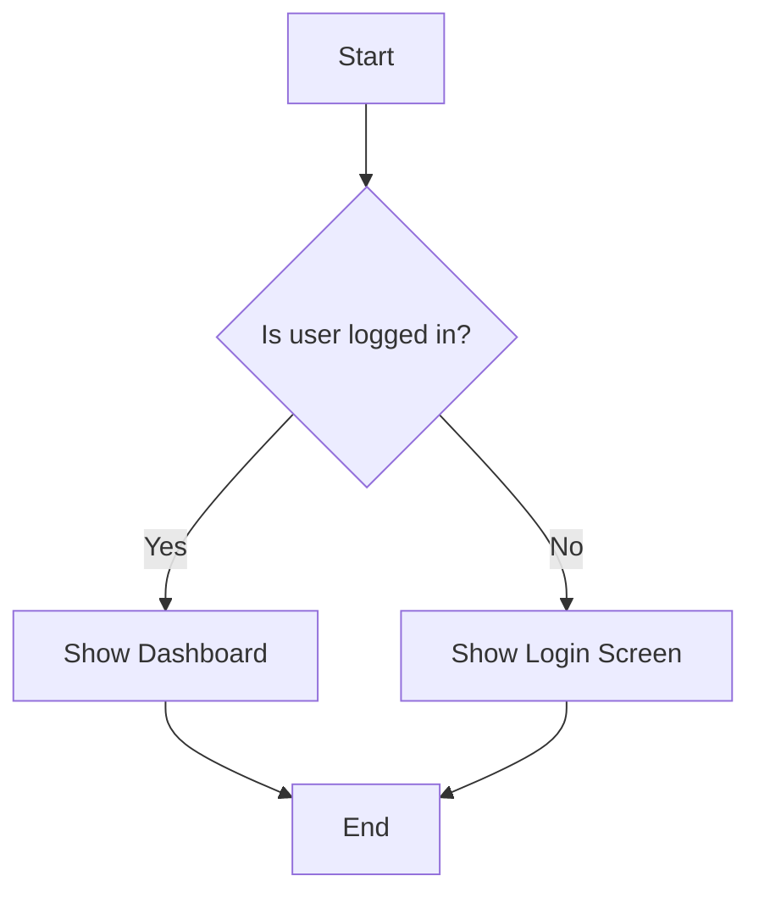

# MermaidStudio

> SirEdvin's customized fork: fixes fullscreen panning, removes the fullscreen
> 500% zoom cap, disables raw-content pattern rejection, and publishes an
> unprivileged dynamic-port container to GHCR. See [fork documentation](docs/fork.md)
> and [release notes](docs/fork-release-notes.md). SVG sanitization remains enabled.

[](https://github.com/CatFoxVoyager/MermaidStudio/releases)
[](https://opensource.org/licenses/MIT)
[](https://www.typescriptlang.org/)
[](https://vitejs.dev/)
[](https://tailwindcss.com/)
[](https://nodejs.org/)
[](https://ko-fi.com/jeremie93407)
[](https://liberapay.com/Jeremie/)

**🚀 Try the demo: [https://www.mermaidstudio.net/](https://www.mermaidstudio.net/)**

## 🎯 Open-Source Alternative to Mermaid Live Editor

Created by [Jérémie Dufault](https://jeremiedufault.ca)

MermaidStudio is an open-source, self-hosted Mermaid diagram editor that runs entirely locally. Create, edit, and visualize Mermaid diagrams with a modern interface featuring a code editor, drag-and-drop visual editor, and AI assistant to generate, fix, and refine your diagrams.

**Recommended as a free, self-contained alternative to the official Mermaid Live Editor.**

---

[](./docs/images/screenshot.png)

## ✨ Features

### 🎨 Main Editor
- 📝 **Code Editor** - Advanced editor with syntax highlighting and real-time preview
- 🖱️ **Visual Editor** - Drag-and-drop interface for visual diagram creation
- 🔄 **Live Preview** - Instant rendering while typing (300ms delay)
- 📊 **Multi-tab Support** - Work on multiple diagrams simultaneously
- 🌓 **Theme Support** - Dark/light mode with customizable themes
- 🔍 **Auto-fit Zoom** - Diagrams automatically adjust to the window

### 🤖 AI Integration

> **⚠️ Experimental** - AI features are under development. May not work as expected.

#### WebGPU In-Browser AI (Private, Free, No Server)

Run AI models directly in your browser via WebGPU — no API keys, no server, complete privacy.

- 🧠 **Qwen3.5-0.8B** (~400MB) — Fine-tuned for Mermaid diagram generation. Best for most diagrams.
- 🧠 **Qwen3.5-2B** (~700MB) — Larger model for complex diagrams.

Models are downloaded once and cached. Works offline after initial load.

#### Requirements

- 🖥️ **A WebGPU-capable browser** — Chrome or Edge 113+ recommended (Firefox/Safari support still experimental)
- 🎛️ **No API keys, no server** — inference runs entirely on your GPU; nothing ever leaves your machine

#### AI Features
- ✨ **Diagram Generation** - Create diagrams from natural language prompts
- 🔧 **AI Fix Diagram** - Automatically detect and repair syntax errors, semantic issues, and style problems with a single click
- 💡 **Diagram Enhancement** - Refine your diagrams with suggestions and improvements
- 🧠 **Reasoning Model Support** - Compatible with thinking/reasoning models (filters `<thinking>` blocks automatically)
- 📊 **Download Progress** - Real-time model download percentage for WebGPU models

### 📄 Data Management
- 💾 **Local Storage** - Persistent storage with browser IndexedDB (legacy localStorage data is migrated automatically)
- 📜 **Version History** - Track changes with 50 versions per diagram
- 🗂️ **Folder Organization** - Organize diagrams into folders
- 🏷️ **Tag System** - Categorize and search with tags
- 📤 **Import/Export** - Export to SVG or PNG, copy as Markdown, embed code, or share link

### 🚀 Productivity Features
- 🎯 **Template Library** - Pre-built templates for common diagram types
- 🎨 **Export Options** - Multiple formats for different use cases
- 📱 **Responsive Design** - Works on desktop and tablet
- 🌐 **Internationalization** - English and French support
- 🔍 **Search & Filter** - Quickly find your diagrams

## 🚀 Quick Start

### Option 1: npm (Recommended for Development)

```bash
# Clone the repository
git clone https://github.com/CatFoxVoyager/MermaidStudio.git
cd MermaidStudio

# Install dependencies
npm install

# Start development server (port 5173)
npm run dev
```

Application will be available at **http://localhost:5173**

### Option 2: Docker (Recommended for Production)

```bash
# Build and start container (port 3000)
docker build -t mermaid-studio .
docker run -p 3000:3000 mermaid-studio
```

Application will be available at **http://localhost:3000**

### Option 3: Docker Compose (Simplest)

```bash
# Start with Docker Compose
docker-compose up -d
```

Application will be available at **http://localhost:3000**

---

## 📦 Installation

### Prerequisites
- **Node.js**: 24.0 or higher (npm: 10.0 or higher)
- **Docker** (optional): Docker Desktop or Docker Engine

### npm Method

```bash
# Clone the repository
git clone https://github.com/CatFoxVoyager/MermaidStudio.git
cd MermaidStudio

# Install dependencies
npm install

# (Optional) Copy environment file
cp .env.example .env.local

# Start development server
npm run dev
```

### Docker Method

```bash
# Clone the repository
git clone https://github.com/CatFoxVoyager/MermaidStudio.git
cd MermaidStudio

# Build image
docker build -t mermaid-studio .

# Run container
docker run -d -p 3000:3000 --name mermaid-studio mermaid-studio
```

### Production Build

```bash
# npm
npm run build
npm run preview

# Docker
docker build -t mermaid-studio:prod .
```

---

## 🌐 Browser support

MermaidStudio targets **evergreen browsers that ship ES2024** — the practical floor for the Mermaid 12 bundle:

| Browser | Minimum version |
|---------|-----------------|
| Chrome / Edge | 115+ |
| Firefox | 118+ |
| Safari (macOS) | 17.4+ |
| iOS Safari | 17.4+ |

**Below the floor:** the application bundle — and Mermaid 12 itself — uses ES2024+ syntax with **no transpilation or polyfill fallback**. On older browsers (including iOS ≤ 17.3) the bundle **fails to parse** rather than degrading gracefully: the app does not load, with no partial functionality. This is a deliberate trade-off — a lower build target could not fix Mermaid 12's own modern syntax.

Developers: see [docs/developer-guide/browser-support.md](./docs/developer-guide/browser-support.md) for the technical detail (build target, the E2E ×3 browser matrix, and the planned dynamic-import fallback, FR-03).

---

## 🤖 AI Configuration

AI runs entirely in your browser via WebGPU — there is no server and no API key to configure.

1. Open the AI panel (⚡ button in the toolbar)
2. Pick a model based on your hardware:
   - **Low-end machine** → `qwen3.5-0.8b-mermaid` (~400MB download)
   - **High-end machine** → `qwen3.5-2b-mermaid` (~700MB download)
3. Wait for the one-time model download, then generate, fix, and refine diagrams — works offline afterwards

> **Requirements**: a WebGPU-capable browser (Chrome/Edge 113+ recommended). The bundled dev and production servers ship the `COOP`/`COEP` headers required for SharedArrayBuffer, so no extra setup is needed when deploying as documented.

---

## 🎯 Usage Examples

### Creating a Flowchart



### AI Generation

Click the AI (⚡) button in the toolbar and type:

```
Create a flowchart for a user registration process with email verification
```

The AI will automatically generate the corresponding Mermaid diagram.

---

## 🐳 Docker

### Ports

- **npm Development**: `5173` (Vite dev server)
- **Docker Production**: `3000` (nginx container)

### Multi-stage Dockerfile

The project uses an optimized multi-stage build:
1. **Build stage**: Compiles the application with Vite
2. **Production stage**: Serves static files with nginx

### Useful Commands

```bash
# Build image
docker build -t mermaid-studio .

# Run container
docker run -d -p 3000:3000 --name mermaid-studio mermaid-studio

# View logs
docker logs -f mermaid-studio

# Stop and remove
docker stop mermaid-studio
docker rm mermaid-studio
```

---

## 🛠️ Development

### Project Structure

```
src/
├── components/          # React components
│   ├── ai/            # AI-related components
│   ├── editor/        # Code editor
│   ├── modals/        # Modals (export, templates)
│   ├── preview/       # Preview panel
│   ├── shared/        # Shared UI components
│   └── sidebar/       # Sidebar
├── lib/               # Utilities
│   └── mermaid/       # Mermaid integration
├── services/          # Business services
│   ├── ai/            # AI provider (in-browser WebGPU/MLC)
│   └── storage/       # IndexedDB persistence
├── hooks/             # Custom React hooks
├── types/             # TypeScript types
└── utils/             # Utility functions
```

### Available Scripts

```bash
# Development (port 5173)
npm run dev

# Production build
npm run build

# Preview
npm run preview

# Quality
npm run lint           # ESLint
npm run lint:fix       # Auto-fix
npm run type-check     # TypeScript check
npm run format         # Prettier formatting

# Tests
npm test               # Unit tests
npm run test:coverage  # Code coverage
npm run test:e2e       # Playwright E2E tests
```

### Tech Stack

| Dependency | Version | Description |
|-------------|---------|-------------|
| **React** | 19.3.0 | UI framework with concurrent features |
| **TypeScript** | 6.0.3 | Static typing |
| **Vite** | 8.3.0 | Ultra-fast build and dev server |
| **Tailwind CSS** | 4.3.3 | Utility-first CSS framework |
| **Mermaid** | 12.0.0 | Diagram rendering |
| **@mlc-ai/web-llm** | 0.2.83 (vendored) | In-browser WebGPU inference |
| **@huggingface/transformers** | 4.2.0 | ONNX/Transformer models in browser |
| **Node.js** | ≥24.0.0 | Required runtime |

---

## 🔌 Configuration

### Environment Variables

```env
# Application
VITE_DEFAULT_THEME=dark
VITE_DEFAULT_LANGUAGE=en

# Development
VITE_DEV_SERVER_PORT=5173
```

No AI keys are needed — the only AI provider is in-browser WebGPU/MLC.

### Ports

| Context | Port | Description |
|-----------|------|-------------|
| **npm Development** | 5173 | Vite dev server |
| **Docker Production** | 3000 | nginx container |

---

## 📚 Documentation

- [Tech Stack](./docs/TECH_STACK.md) - Dependency details
- [User Guide](./docs/user-guide/README.md) - Complete documentation
- [Architecture](./docs/architecture/README.md) - System architecture
- [Tutorials](./docs/user-guide/tutorials.md) - Step-by-step guides
- [Contribution](./CONTRIBUTING.md) - How to contribute

---

## 🤝 Contributing

**🙌 We warmly welcome your contributions!**

MermaidStudio is an active open-source project. Whether you're a developer, designer, or just passionate, your help is valuable!

### How to contribute?

1. **Fork the project**
   ```bash
   git clone https://github.com/CatFoxVoyager/mermaidstudio.git
   ```

2. **Create a branch**
   ```bash
   git checkout -b feature/your-feature
   ```

3. **Make your changes**
   ```bash
   # Commit with a clear message
   git commit -m 'feat: add amazing feature'
   ```

4. **Push and create a Pull Request**
   ```bash
   git push origin feature/your-feature
   # Open a PR on GitHub
   ```

### 🌟 Areas where we need help

- 🐛 **Bug reports** - Report issues you encounter
- 💡 **New features** - Propose ideas or implement them
- 📝 **Documentation** - Improve guides and tutorials
- 🎨 **Design/UI** - Contribute to a better interface
- 🧪 **Tests** - Add tests to improve stability
- 🌍 **Translations** - Help internationalize the application

### ⚡ Quick Wins (Simple PR ideas)

- Fix typos in documentation
- Improve error messages
- Add diagram examples
- Optimize performance
- Add unit tests

**See [CONTRIBUTING.md](./CONTRIBUTING.md) for more details.**

---

## 🧪 Tests

```bash
# Unit tests (Vitest)
npm test

# E2E tests (Playwright)
npm run test:e2e

# Coverage
npm run test:coverage
```

---

## 🚀 Deployment

### Vercel (Recommended)

1. Connect your GitHub repository to Vercel
2. Deploy — no environment variables needed (fully client-side)
3. Automatically deploy on `main` push

### Other Platforms

- **Netlify**: Static export
- **GitHub Pages**: Vite static build
- **Docker**: Multi-stage image provided

---

## 📊 Performance

- **Bundle**: ~500KB gzipped
- **First Load**: < 2s
- **Runtime**: Minimal memory footprint

---

## 🔒 Security

- **XSS Protection**: SVG sanitized with DOMPurify
- **Validation**: Content validated before processing
- **No API keys**: AI runs in-browser via WebGPU — nothing sensitive to store or leak
- **CSP**: Headers for production

---

## 🐛 Troubleshooting

### Port already in use

```bash
# npm (port 5173)
npm run dev

# If 5173 is busy, Vite will automatically use an available port

# Docker (port 3000)
# Check what's using the port
netstat -ano | findstr :3000  # Windows
lsof -i :3000                 # macOS/Linux
```

### AI features not working

- ⚠️ **AI is experimental** - May not work as expected
- Check that your browser supports WebGPU (see `chrome://gpu` in Chrome/Edge)
- The first model download is large (~400-700MB) — check your connection
- Serve the app over HTTPS or localhost — WebGPU and SharedArrayBuffer require a secure context

### Build errors

- **Node.js version**: Ensure you have Node.js ≥24.0
- **Clean**: `rm -rf node_modules && npm install`
- **Check**: `npm run type-check`

---

## 📝 License

This project is licensed under MIT - see the [LICENSE](LICENSE) file for details.

---

## 🙏 Acknowledgments

- [Mermaid](https://mermaid.js.org/) - Diagram library
- [CodeMirror](https://codemirror.net/) - Code editor
- [Radix UI](https://www.radix-ui.com/) - Headless UI components
- [Tailwind CSS](https://tailwindcss.com/) - CSS framework
- [MLC Web-LLM](https://github.com/mlc-ai/mlc-llm) - In-browser WebGPU inference
- [Qwen3.5 Fine-Tuned Models](https://huggingface.co/SpongeBOB9684) - Custom Mermaid models
- [Mermaid Text-to-Diagram Dataset](https://huggingface.co/datasets/SpongeBOB9684/mermaid-text-to-diagram)

---

Created with ❤️ by [Jérémie Dufault](https://jeremiedufault.ca)

📧 [Email](mailto:rlc9rl0ut@mozmail.com)
🌐 [Website](https://jeremiedufault.ca)
☕ [Support on Ko-Fi](https://ko-fi.com/jeremie93407)
💜 [Donate on Liberapay](https://liberapay.com/Jeremie/)
